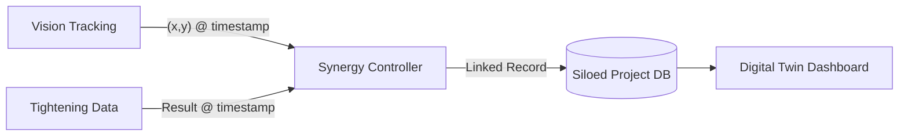

# Stage 3 Blueprint: Vision-Data Digital Twin Synergy

This stage bridges the gap between **"Where the tool is"** (Vision) and **"How the tool performed"** (Data) to create a holistic Digital Twin of the assembly process.

## 核心目标 (Core Objectives)

### 1. 空间与数据的时空关联 (Spatial-Data Correlation)
- **时钟同步 (Sync Engine)**：建立毫秒级的统一时钟，确保视觉轨迹（Tracking Trace）与拧紧控制器结果（Result Event）在时间轴上精准对齐。
- **坐标映射 (Slot Mapping)**：将视觉识别到的工具 $(x, y)$ 像素坐标，通过仿射变换或关键点识别，映射为工件上的“槽位 ID (Slot ID)”。

### 2. 统一数字孪生面板 (Unified Digital Twin Dashboard)
- **实时热力图 (Real-time Heatmap)**：在视频流或工件底图上实时渲染拧紧质量。绿色点表示 OK且 AI 形状匹配，红色点表示异常。
- **双向追溯 (Bidirectional Traceability)**：
    - 点击地图上的螺栓位置 -> 弹出对应的 **AI 形状诊断分析**。
    - 点击异常曲线 -> 自动回放视频中该时刻的**视觉动作轨迹**。

### 3. 操作员实时导航 (Real-time Operator Guidance)
- **增强现实提示 (AR Overlay)**：在视觉监控界面实时显示“当前应拧紧位置”提示。
- **序列验证 (Sequence Validation)**：自动判定螺栓拧紧顺序是否符合工艺要求，防止漏拧或错拧。

---

## 技术架构 (Technical Architecture)

### 核心模块组件
1. **`SynergyController` (NEW)**: 监听 `VisionService` 和 [DatasetService](file:///c:/Users/HenryShh/Antigravity-project/henrys-discovery-metaverse/src/services/dataset_service.py#16-375) 的事件流，根据时间戳进行 Match 合并。
2. **`WorkpieceManager` (NEW)**: 定义工件的“槽位图谱 (Slot Map)”，支持手动定义或自动识别螺栓群布局。
3. **`DigitalTwinUI` (Streamlit + Plotly/OpenCV)**: 实现融合渲染的视频流界面。

### 数据流模型

---

## 验证计划 (Verification Plan)

### 功能测试
- 模拟一个拧紧动作：视觉识别到移动到 A 点，同时发送 20Nm OK 数据。验证系统能否将该数据自动标注在 A 点。

### 交互测试
- 验证在地图上点击螺栓位置是否能准确调出对应的 AI 曲线诊断。
